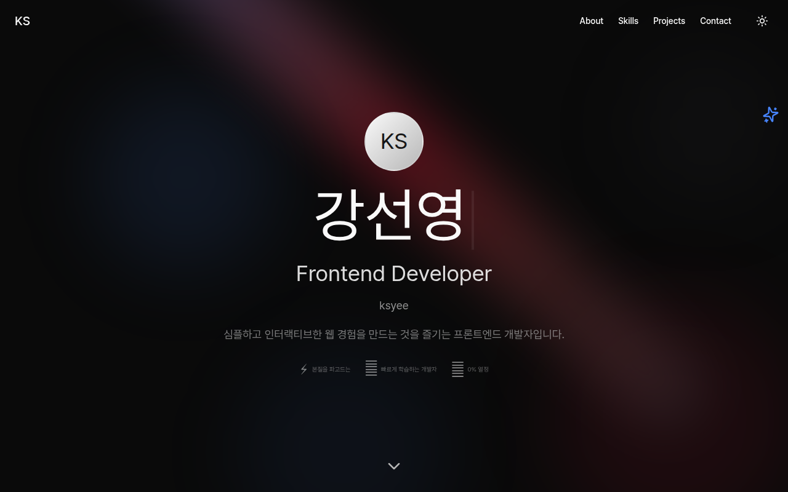

# 포트폴리오 (NEW)

나만의 경험과 프로젝트를 소개하는 개인 포트폴리오 웹사이트입니다.
React와 TypeScript를 기반으로 구축되었으며, 모던한 UI/UX를 위해 Tailwind CSS와 Framer Motion을 활용했습니다.



## 🛠 Tech Stack

### Core


### Styling & UI


## ✨ Features

- **프로젝트 쇼케이스**: Findit, K-type, Taing 등 주요 프로젝트의 상세 정보, 기술 스택, 기여도를 카드 형태로 제공합니다.
- **기술 스택 시각화**: 보유 기술의 숙련도를 직관적인 그래프나 수치로 표현합니다.
- **인터랙티브 UI**: Framer Motion을 활용한 부드러운 전환 효과와 애니메이션을 제공합니다.
- **반응형 디자인**: 모바일, 태블릿, 데스크탑 등 다양한 해상도에 대응합니다.

## 🚀 Getting Started

이 프로젝트는 **pnpm** 패키지 매니저를 사용합니다.

### Installation

의존성을 설치합니다.

```bash
pnpm install
```

### Development

개발 서버를 실행합니다.

```bash
pnpm run dev
```

브라우저에서 `http://localhost:3000`으로 접속하여 확인할 수 있습니다.

### Build

배포를 위한 빌드를 수행합니다.

```bash
pnpm run build
```

## 📂 Included Projects

| 프로젝트명    | 설명                                              | 주요 기술                  |
| ------------- | ------------------------------------------------- | -------------------------- |
| **Findit**    | 경찰청 공공데이터 API를 활용한 분실물 조회 서비스 | React, TS, Tanstack Query  |
| **K-type**    | 실시간 분석 기능을 갖춘 한글 타이핑 연습 사이트   | Next.js, Zustand, Supabase |
| **Taing**     | 티빙(TVING) 스트리밍 서비스 클론 코딩             | Vanilla JS, Pocketbase     |
| **SGI Clone** | SGI 서울보증보험 웹사이트 클론                    | jQuery, CSS Animation      |

---

© 2024 Portfolio. All rights reserved.
